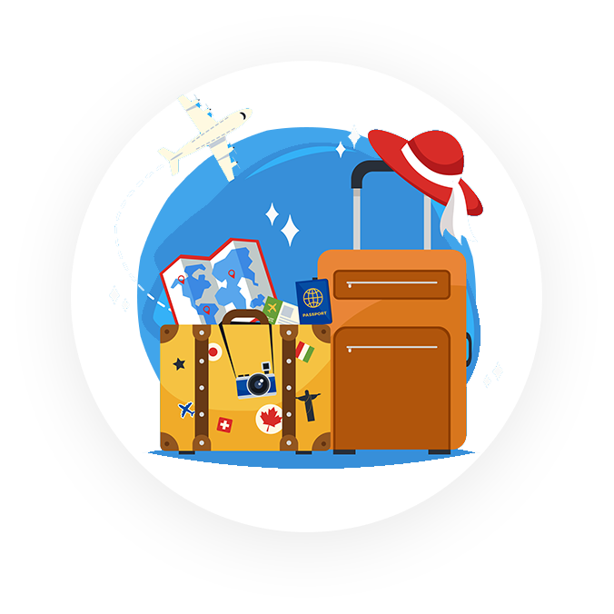

<!DOCTYPE html>
<html lang="ru">
<head>
    <title>Landing Page</title>
    <meta charset="UTF-8">
    <meta http-equiv="X-UA-Compatible" content="IE=edge">
    <meta name="viewport" content="width=device-width, initial-scale=1">
    
    <link href="https://cdn.jsdelivr.net/npm/bootstrap@5.1.3/dist/css/bootstrap.min.css" rel="stylesheet" integrity="sha384-1BmE4kWBq78iYhFldvKuhfTAU6auU8tT94WrHftjDbrCEXSU1oBoqyl2QvZ6jIW3" crossorigin="anonymous">
    <link rel="stylesheet" href="css/main.css">
</head>
<body>
    <header id="header" class="header">
        

            
                
    
                     

                        <h1 class="title">С помощью верстки я создам ту жизнь, о которой  мечтаю!
                        </h1>
                        
Мои стремления + настойчивость позволят мне достичь чего угодно. Я не верю в это. Я знаю это на 100%. Меня не остановить!
                        

                        <a href="#" class="btn">Двигаться к мечте!</a>
                    

                
                

        
 
    </header>
    <section id="learn" class="learn">
        

            <h2 class="selection-title">
                Что меня ждет впереди
            </h2>
    

        

            
                 <h3>Свободное время
                 </h3>
            

                Мне нужно свободное время на семью и самое настоящее
            

        

        

            
                <h3>Яркие путешествия
                </h3>
            
Работать откуда угодно - что может быть лучше?            
            

        

        

            
                <h3>Создание ценности
                </h3>
            
Нет ничего сильнее, чем жить не просто так, создавая ценность            
            

        

    
    
    </section>
    <section id="mail" class="mail">
        

            <h2 class="selection-title">
                Форма заказа билета в будущее
            </h2>
        <form action="#" class="form">
            <input type="name" placeholder="Имя" name="name" class="input" required>
            <input type="e-mail" placeholder="E-mail" name="e-mail" class="input">
            <input type="phone" placeholder="Телефон" name="phone" class="input">
            <input type="fly" placeholder="Куда я полечу в ближайщее время?" name="fly" class="input">
            <button type="submit" class="btn">Двигаться к мечте!</button>
        </form>
         

    </section>
        <footer id="footer" class="footer">
            

                
© Все мои мечты защищены моим трудолюбием

            

        </footer>
    </body>
</html>
